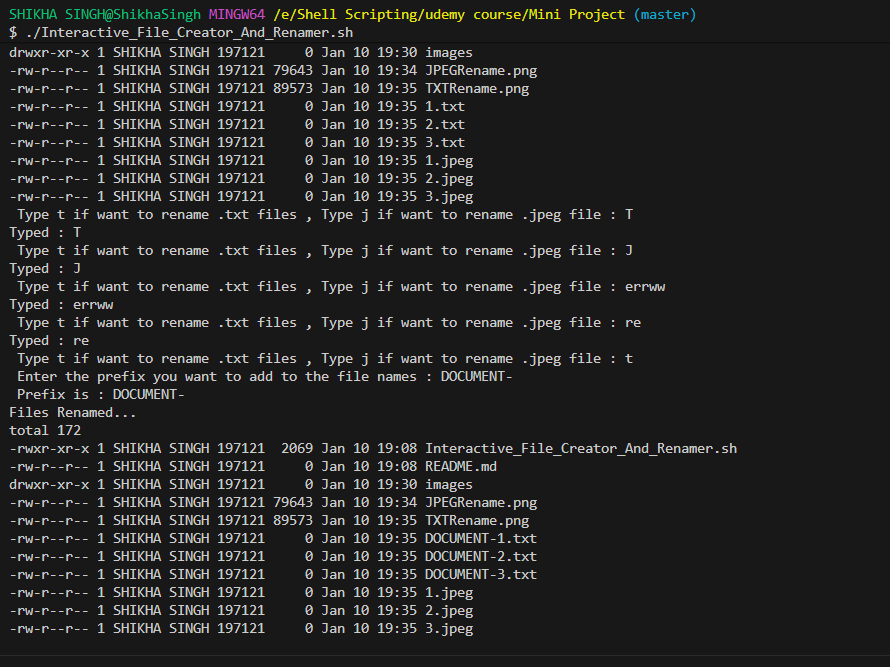
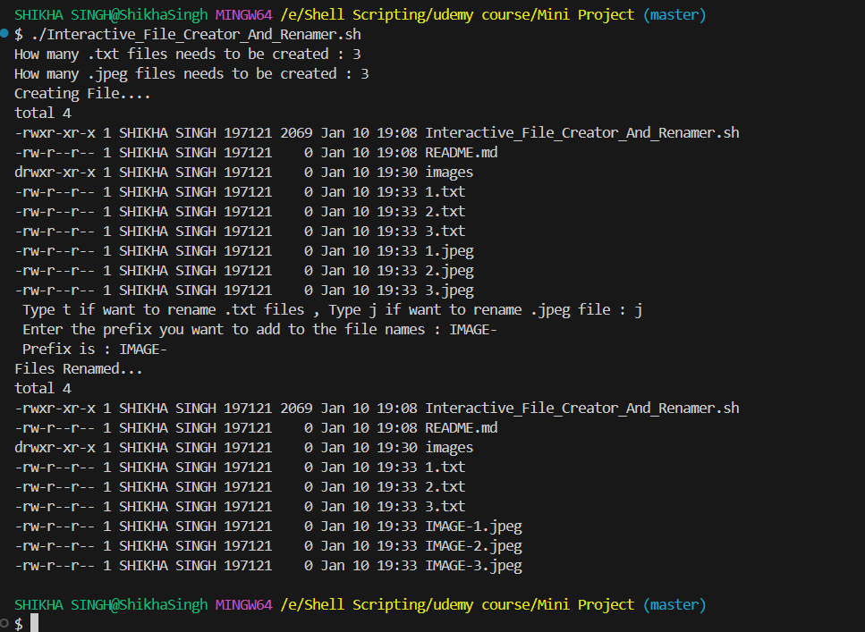

# Interactive File Creator & Renamer (Shell Script)

This project is a beginner-friendly shell script that interactively creates and renames files based on user input.

The goal of this repository is twofold:

- Help beginners understand user input, loops, conditions, and file operations in shell scripting

- Showcase my learning journey in Shell Scripting, step by step, through clearly defined milestones

This is Milestone A of the project, and more features will be added incrementally.


## Features (Milestone A)

✔️ Asks the user:

* How many .txt files to create

* How many .jpeg files to create

✔️ Creates the files accordingly

✔️ Asks the user which file type to rename:

* t → .txt files

* j → .jpeg files

✔️ Input validation

* If the user enters anything other than t or j, the script keeps asking until valid input is provided

✔️ Asks for a prefix

* Renames all selected files by adding the prefix to their names

✔️ Written using simple and readable shell scripting constructs, suitable for beginners


## Tech Stack

* Shell / Bash

* Linux / Unix-based environment


## How to Run the Script

**Clone the repository:**

```git clone https://github.com/ShikhaSingh1807/Interactive-File-Creator-Renamer-Shell-Script.git```


**Navigate to the project directory:** 

```cd Interactive-File-Creator-Renamer-Shell-Script```


**Make the script executable:**

```chmod +x Interactive_File_Creator_And_Renamer.sh```


**Run the script:**

```./Interactive_File_Creator_And_Renamer.sh```

## Demo

Below is a sample execution of the script showing how it interacts with the user:

- Prompts the user for the number of `.txt` and `.jpeg` files to create
- Validates user input for file type selection
- Renames files using a user-defined prefix
- In below image user input wrong file type to rename and hence is prompted again and again and finally selects ".txt" as the target file type






